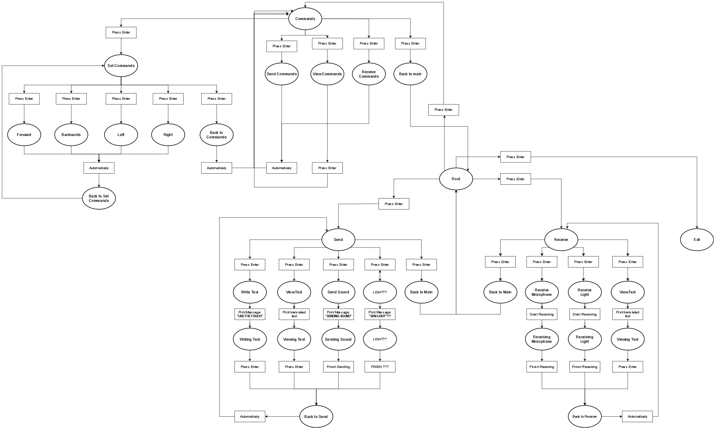

# Lego_NXT-Morse
*Implement Morse communication between 2 lego NXT from Microphone.*

**LEGO MINDSTORMS NXT PROJECT**
**Course CS428 Embedded Systems**
**Computer Science Department University Of Crete**

- Thodoris Pontzouktzidis csd4336 https://github.com/Thodorhs
- Dimitris Vlachos csd4492 https://github.com/alexander459
- Alexandros Tevrentzidis csd4383 https://github.com/Jvlachos

## Abstract

### Project Core.

***We Used all the drivers we made for previously (Lego_NXT repos.)
to Implement Morse communication between 2 Lego NXT bricks.
aic | pit | lcd | spi | pio | twi***

### Welcome message.

***when the brick powers on display a logo frame and the first letters of
each teammate name accompanied by the corresponding morse beeps.***

### Tree like data structure for menu.

***The menu is designed as a tree-like data structure.
Everything for the menu visuals and functionality happens in 2
switches. We change the current_nav_state depending on which node-menu
option we are and which button is pressed. We also have a variable
index_of_children that acts as an index for changing the current node
everytime we click enter and we select a menu option and as an index for
selecting the correct text of the current node and outline it with
arrows.***

### Project.
***Morse communication between 2 lego NXT using the Microphone.
writing/sending text with morse.
sending/executing commands (forward, right, left, back).***

### Timeline.

-   Create startup welcome message ✅
-   Design a tree like data structure for menu implementation ✅
-   Implement menu Visuals & functionality ✅
-   Implement Morse translation utility functions ✅
-   Implement touch sensor Morse input ✅
-   Implement sound Morse output ✅
-   Implement Mic Morse receive ✅
-   Implement Mic Morse Send/Execute commands ✅

## Prerequisites
- make
- (ubuntu easier setup)
- Lego toolchain repo

## How to run
In the makefile change the PREFIX (first line) to the lego toolchange dir e.g PREFIX=../lego-toolchain_23-master

- make clean
- make
- set NXT on re-program mode (one way to do this is by the pin hidden on the back of the brick or you can use the middle grey button).
- make download
